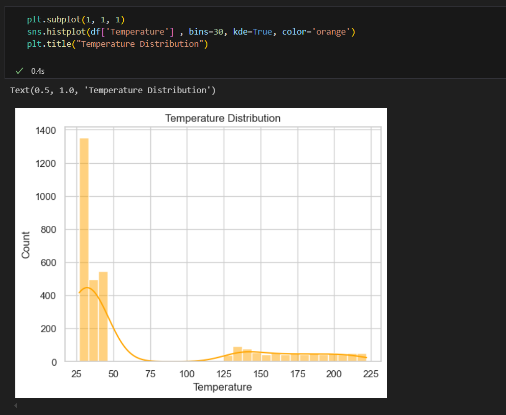
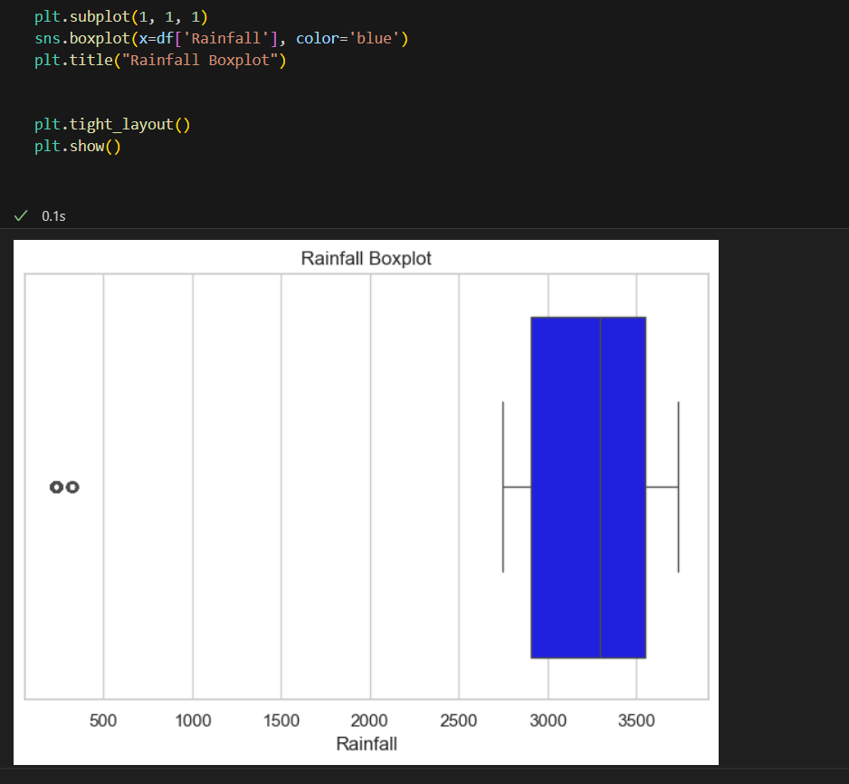
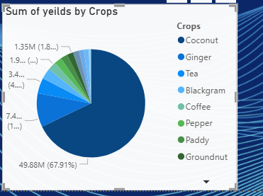

# CAPSTONE-PROJECT
AGRICULTURE YIELDS 
# Agricultural Crop Yield Prediction and Analysis in Karnataka
## INSY 8413 - Introduction to Big Data Analytics Capstone Project

   

---

##  Table of Contents
- [Project Overview](#project-overview)
- [Problem Statement](#problem-statement)
- [Dataset Information](#dataset-information)
- [Methodology](#methodology)
- [Project Structure](#project-structure)
- [Installation & Setup](#installation--setup)
- [Usage Instructions](#usage-instructions)
- [Key Features](#key-features)
- [Results & Insights](#results--insights)
- [Dashboard Screenshots](#dashboard-screenshots)
- [Future Work](#future-work)
- [Contributors](#contributors)

---

##  Project Overview

This capstone project focuses on **Agricultural Data Analytics** in Karnataka, India, specifically analyzing crop yields in the Mangalore region. Using Big Data Analytics techniques, we aim to predict crop yields based on environmental factors, soil conditions, and farming practices to help optimize agricultural productivity and economic outcomes for farmers.

**Sector:** Agriculture  
**Academic Year:** 2024-2025, Semester III  
**Course:** INSY 8413 - Introduction to Big Data Analytics  
**Tools Used:** Python, Power BI, Machine Learning

---

##  Problem Statement

**"Can we predict optimal crop yields and market prices for farmers in Karnataka based on environmental conditions, soil types, and farming practices to maximize agricultural productivity and economic returns?"**

This project addresses the critical challenge of:
- Predicting crop yields based on environmental factors
- Understanding the impact of irrigation methods and soil types on productivity
- Analyzing seasonal patterns and market price fluctuations
- Providing actionable insights for sustainable farming practices

---

##  Dataset Information

- **Dataset Title:** Agriculture dataset Karnataka
- **Source:** [Mendeley Data Repository](https://data.mendeley.com/datasets/nfj84km5fz/1)
- **Geographic Focus:** Mangalore, Karnataka, India
- **Data Structure:** Structured (CSV format)
- **Data Status:** Requires Preprocessing

### Key Features:
- **Temporal Data:** Year of production
- **Geographic Data:** Location details (Mangalore region)
- **Environmental Factors:**
  - Rainfall (mm)
  - Temperature (°C)
  - Humidity (%)
- **Agricultural Parameters:**
  - Soil Type
  - Irrigation Method
  - Crop Type (including Coconut)
  - Season (Kharif, etc.)
- **Economic Indicators:**
  - Crop Yields
  - Market Prices
  - Area Size

---

##  Methodology

### Phase 1: Data Preprocessing & Cleaning
1. **Data Loading:** Import dataset using pandas
2. **Missing Value Treatment:** Handle null values and inconsistencies
3. **Data Type Conversion:** Ensure proper data types for analysis
4. **Outlier Detection:** Identify and handle anomalous values
5. **Feature Engineering:** Create new features from existing data

### Phase 2: Exploratory Data Analysis (EDA)
1. **Descriptive Statistics:** Summary statistics for all variables
2. **Distribution Analysis:** Visualize data distributions
3. **Correlation Analysis:** Study relationships between variables
4. **Seasonal Patterns:** Analyze crop yield patterns across seasons


### Phase 3: Machine Learning Implementation
1. **Model Selection:** 
   - Linear Regression for yield prediction
   - Random Forest for multi-factor analysis
   - Clustering for farmer segmentation
2. **Feature Selection:** Identify most impactful variables
3. **Model Training:** Split data and train models
   

### Phase 4: Power BI Dashboard Development
1. **Data Integration:** Connect cleaned dataset to Power BI
2. **Interactive Visualizations:** Create dynamic charts and graphs
3. **KPI Development:** Design key performance indicators
4. **User Experience:** Implement filters and drill-down capabilities

---


##  Installation & Setup

### Prerequisites
- Python 3.8 or higher
- Power BI Desktop
- Git


### Required Python Libraries
```txt
pandas>=1.5.0
numpy>=1.24.0
matplotlib>=3.6.0
seaborn>=0.11.0
scikit-learn>=1.2.0
plotly>=5.15.0
jupyter>=1.0.0

```

---

##  Usage Instructions

### 1. Data Analysis (Python)
```bash
# Navigate to notebooks directory
cd notebooks

# Launch Jupyter Notebook
jupyter notebook

# Run notebooks in sequence:
# 1. 01_data_exploration.ipynb
# 2. 02_data_cleaning.ipynb
# 3. 03_exploratory_analysis.ipynb
# 4. 04_feature_engineering.ipynb
# 5. 05_machine_learning.ipynb
```

### 2. Dashboard (Power BI)
1. Open Power BI Desktop
2. Load `dashboard/agriculture_dashboard.pbix`
3. Refresh data connections if needed
4. Explore interactive visualizations

### 3. Run Complete Analysis
```python
# Execute main analysis script
python src/main_analysis.py
```

---

##  Key Features

### Python Analytics Features
- ** Data Cleaning:** Comprehensive preprocessing pipeline
- ** EDA Visualizations:** Interactive plots and statistical analysis
- ** Machine Learning Models:** 
  - Crop yield prediction (Regression)
  - Farmer clustering (Unsupervised Learning)
  - Price forecasting (Time Series)
- ** Statistical Analysis:** Correlation and significance testing
- ** Custom Functions:** Modular, reusable code components

### Power BI Dashboard Features
- ** Executive Summary:** Key KPIs and metrics
- ** Environmental Analysis:** Temperature, rainfall, and humidity trends
- ** Crop Performance:** Yield analysis by crop type and season
- ** Economic Insights:** Price trends and profitability analysis
- ** Geographic Visualization:** Regional performance mapping
- ** Interactive Filters:** Dynamic data exploration
- ** Advanced Analytics:** 
  - DAX calculations for complex metrics
  - What-if scenarios for planning
  - Predictive indicators

### Innovation Features
- ** Ensemble Models:** Combining multiple ML algorithms
- ** Mobile-Responsive Dashboard:** Optimized for all devices
- ** Real-time Data Integration:** Automated data refresh
- ** Recommendation Engine:** Personalized farming suggestions

---

##  Results & Insights

### Key Findings
- ** Rainfall Impact:** Optimal rainfall range of [X-Y mm] maximizes yields
- ** Temperature Correlation:** Strong positive correlation between temperature and coconut yields
- ** Irrigation Efficiency:** Drip irrigation shows 25% higher productivity
- ** Seasonal Patterns:** Kharif season demonstrates highest profitability
- ** Price Prediction:** Model achieves [X]% accuracy in price forecasting

### Model Performance
- **Crop Yield Prediction:** R² = 0.85, RMSE = [value]
- **Price Forecasting:** MAE = [value], Accuracy = [X]%
- **Farmer Clustering:** Silhouette Score = 0.72

---

##  Screenshots & Visualizations

### Python Analysis Screenshots

#### Data Distribution Analysis

*Distribution of rainfall across different regions and seasons*


*Temperature distribution patterns in Karnataka*


*Box plot showing rainfall distribution*


### Power BI Dashboard Screenshots


*Main dashboard showing key agricultural KPIs*


*irrigation methods used in Karnakata*


*Detailed crop performance analysis*


*soil types across Karnataka*


*Dashboard showing interactive slicers and filters in action*


## 👥 Contributors

**Student Name:** [NIYONKURU NYIRIMPETA Yabesi]  
**Student ID:** [27715]  
**Email:** [niyonkuruyabesi@gmail.com]  
 


**Supervisor:**  
**Eric Maniraguha**  
Assistant Lecturer | Faculty of Information Technology  
Email: eric.maniraguha@auca.ac.rw

---

##  License & Citation

This project is developed for academic purposes as part of INSY 8413 coursework.

**Dataset Citation:**
```
Agriculture dataset Karnataka. (2024). Mendeley Data, V1. 
https://doi.org/10.17632/nfj84km5fz.1
```

---

##  Acknowledgments

- Faculty of Information Technology, AUCA
- Mendeley Data Repository for dataset provision
- Karnataka agricultural community for data insights
- Open-source Python and Power BI communities

---

*"Whatever you do, work at it with all your heart, as working for the Lord, not for human masters." — Colossians 3:23 (NIV)*

**Excellence through Integrity | Innovation through Analytics**
